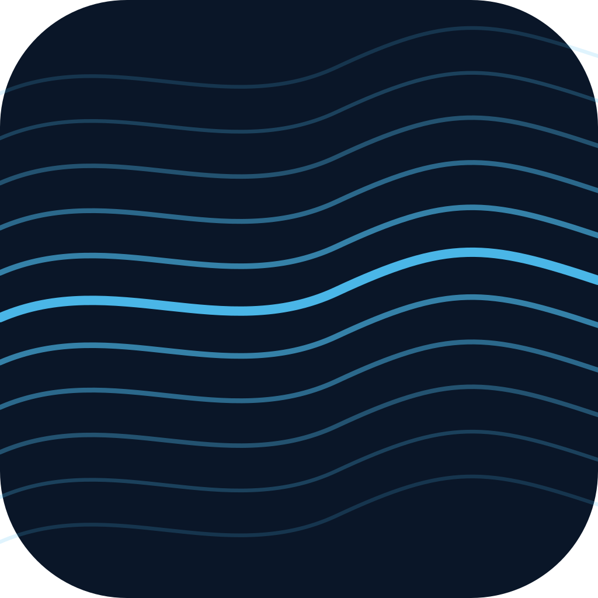

<p align="center">
  
</p>

# Aether

Personal-OS substrate. Holographic Electron shell on top of a signed mesh, with voice as a first-class participant.


[](https://github.com/ashwinsreedhar28/Aether/tags)

> Project built under the working name **homeOS** through v0.3.x; renamed to **Aether** with the v0.4.0 line. The GitHub repository still lives at `ashwinsreedhar28/Aether`; GitHub's auto-redirect keeps any older `homeOS` clone URLs working.

## What this is

Aether is a personal operating environment — a single shell where the user's data, voice, agents, and eventually physical-world peripherals all live as nodes on a common mesh. Currently pre-1.0, macOS-only, single-developer.

This repo is the workspace half (an Electron app on the developer's laptop). The eventual home-substrate half (an always-on box with peripherals as mesh nodes) shares the same codebase but deploys differently.

## Current state (v0.5.0)

- **Mesh substrate alive** (`v0.1.0`): RAVEN_MESH Core runs as a managed daemon; HMAC-signed envelopes; edge-graph authorization; nodes spawn under a lifecycle-aware supervisor with clean SIGTERM teardown.
- **Voice arrived** (`v0.2.0`): raven-daemon supervises a Python orchestrator (Gemini Live API); time + memory + notify tools active; status pill, transcripts, and tool-call history visible in a Voice app.
- **Voice meets mesh** (`v0.2.1`): raven registered as a mesh node; `notify(title, body)` routes through `host_notifications.notify` via mesh.invoke — first end-to-end voice ↔ mesh round-trip.
- **Data realization** (`v0.3.0`): `news_feeds` node polls four RSS sources every 15min, dedupes by stable id, stores in SQLite (WAL). Single `news_feeds.recent` surface consumed by both the News app and the raven voice node — first multi-consumer surface on the mesh.
- **Composers / multi-hop mesh** (`v0.4.0`): first composer node `digest` synthesizes `digest.morning()` / `digest.evening()` briefings by fanning out to upstream data nodes (`news_feeds`, `finance`, weather) in parallel via `Promise.allSettled` with per-upstream timeouts — proves the mesh-as-a-graph property (every prior node was a leaf). `BriefingSection[]` shape with voice-readable `summary` prose plus optional structured `items`.
- **Identity inflection** (`v0.5.0`): project renamed homeOS → Aether (working name retired). New aurora-curtain app icon (cosmic-navy, Concept C). One-time idempotent userData migration on first boot (`~/Library/Application Support/homeOS` → `~/Library/Application Support/Aether`) preserves news / finance / memory state. Workspace package scope (`@homeos/*` → `@aether/*`), bundle identifier (`com.aether.app`), preload bridge global (`window.aether`), and env vars (`AETHER_DATA_DIR`) all updated coherently.
- **Content apps**: Welcome, News (real RSS via mesh), Markdown viewer, Voice control, Mesh Dev Tools.

See [CHANGELOG.md](CHANGELOG.md) for the full version history.

## Quickstart

Requires macOS, Node 22+, pnpm 9.15+, Python 3.10+, and a Gemini API key for voice.

```sh
git clone --recursive https://github.com/ashwinsreedhar28/Aether.git
cd Aether/shell
pnpm install
export GEMINI_API_KEY="..."
pnpm dev
```

First boot takes ~30s for the Python venv bootstrap. Subsequent boots are near-instant.

## Architecture

```
shell/                    Electron shell (holographic theme, app discovery)
├─ electron/main/         Process supervision, mesh + raven daemon managers
├─ electron/preload/      window.aether bridge (mesh, files, voice)
└─ src/apps/              Content apps (welcome, news, markdown, voice-control, mesh-devtools)

core/                     Vendored RAVEN_MESH (Python broker + SDKs)
├─ core/                  Python broker (signed envelopes, SSE delivery)
├─ node_sdk/              Python SDK (used by raven-core)
├─ node_sdk_ts/           TypeScript SDK (used by shell + nodes)
└─ schemas/               Envelope + surface JSON Schemas

nodes/                    Mesh nodes (one process each)
├─ host_notifications/    Native macOS notifications via osascript
└─ news_feeds/            RSS polling + SQLite storage; news_feeds.recent surface

daemons/                  Detached supervised processes
├─ raven-daemon/          Node HTTP+WS supervisor (port 7433, loopback-only)
└─ raven-core/            Python Gemini Live orchestrator + tools

manifest.yaml             Mesh topology: nodes + edges
_ingest/                  Reference repos (submodules, read-only)
```

The mesh is the load-bearing primitive. Every cross-system interaction — voice asks a node for data, the shell triggers a node action — goes through signed envelopes that the manifest's edge graph authorizes. Single source of truth for what's allowed to talk to what.

## Governance

Aether is built collaboratively with Claude Code under an explicit 4-role model:

- **Director** (human, project owner): picks direction, visually verifies, authorizes merges.
- **Architect** (LLM session, design): writes specs, reviews PRs.
- **Implementer** (Claude Code sessions, one per git worktree): writes code, opens PRs.
- **Merge gate** (Director): clicks merge after Architect signs off.

See [CLAUDE.md](CLAUDE.md) for the full operating manual — branching, tagging, self-review template, decision-recording, and accumulated gotchas. Architectural decisions live in [DECISIONS.md](DECISIONS.md).

## Project context

This repo synthesizes patterns from four earlier projects (vendored as `_ingest/*` submodules for reference):

- **Pulse** — Electron menu-bar app with multi-service engines (news, finance, etc.)
- **RAVEN_MESH** — the mesh broker, now the spine of Aether
- **NEXUS** — agent orchestration patterns and security lessons
- **VIEWER** — modular desktop with daemon-supervised voice

See `MASTER_SYNTHESIS.md` for the architectural map that drove the rebuild.

## Status

Pre-1.0. Tags map to capability categories lighting up:

| Tag       | Meaning                                       |
|-----------|-----------------------------------------------|
| `v0.0.x`  | Shell, content apps, governance scaffolding   |
| `v0.1.0`  | Mesh substrate alive                          |
| `v0.2.0`  | Voice arrives                                 |
| `v0.2.1`  | Voice meets mesh                              |
| `v0.3.0`  | Data realization (real data via mesh nodes)   |
| `v0.4.0`  | Composers / multi-hop mesh                    |
| `v0.5.0`  | Identity inflection (homeOS → Aether)         |

## License

MIT — see [LICENSE](LICENSE).

---

Built with [Claude Code](https://claude.com/claude-code).


## Requirements

- **Node 22+** (LTS)
- **pnpm 9+**
- **macOS 13+**
